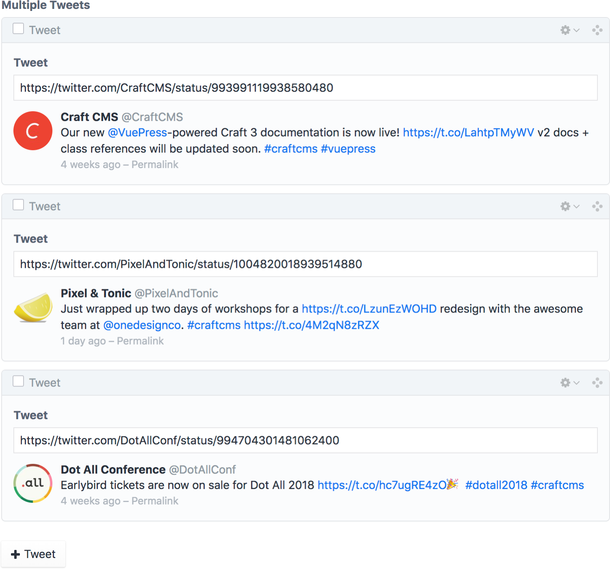

# Tweet Field

## The Field
The Tweet field lets you paste a tweet URL and preview the tweet from the control panel.


## Templating

The Tweet field returns the tweet’s URL, which is then used to retrieve the tweet. 

```twig



    <div class="tweet">
        
        <p><cite><a href="{{ tweet.url }}">{{ tweet.username }} (@{{ tweet.userScreenName }})</a></cite></p>
        <blockquote>{{ tweet.text|autoLinkTweet }}</blockquote>
    </div>

```

## Using the Tweet field with Matrix
You can also use the Tweet field with Matrix to combine multiple tweets together.



```twig

    

    
        <div class="tweet">
            
            <p><cite><a href="{{ tweet.url }}">{{ tweet.username }} (@{{ tweet.userScreenName }})</a></cite></p>
            <blockquote>{{ tweet.text|autoLinkTweet }}</blockquote>
        </div>
    

```