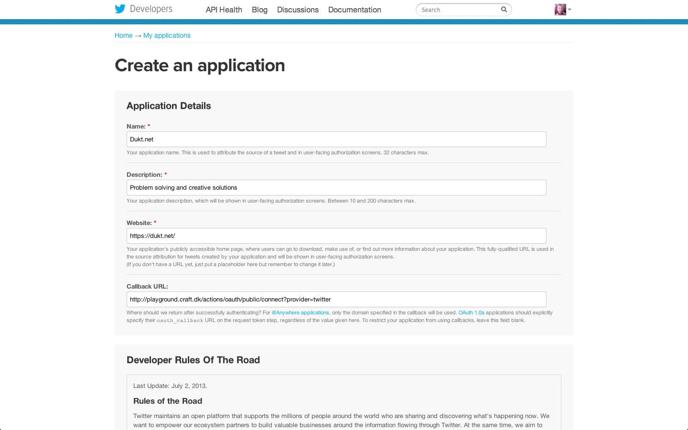
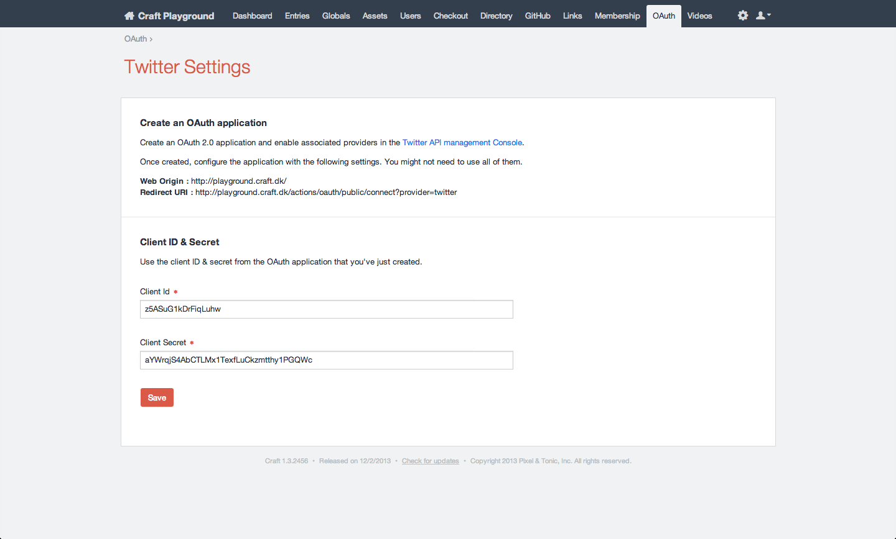

# Connect to Twitter

## Setup OAuth

Twitter plugin relies on OAuth plugin for authenticating to Google APIs :

[OAuth plugin for Craft CMS](https://github.com/dukt/oauth)

You'll be invited to download and install OAuth in Twitter plugin settings.

## Create an application on Twitter

Once OAuth is installed, [create an application on Twitter](https://dev.twitter.com/apps) in order to get a **client ID & secret**.

Then go to **Craft Admin / OAuth / Twitter** in order to fill your client ID and secret.

## Setup Twitter plugin

OAuth and Twitter settings are now all OK. We are now ready to connect to a Twitter account.
Go to to **Twitter plugin settings**, under **Craft Admin / Settings / Twitter**, and click Connect.