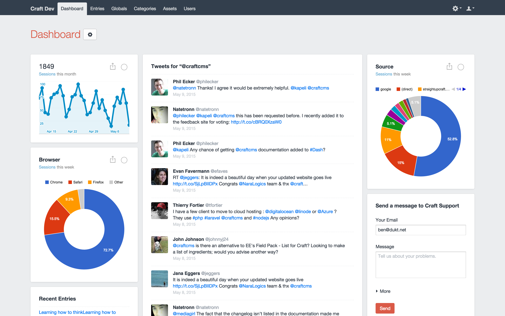
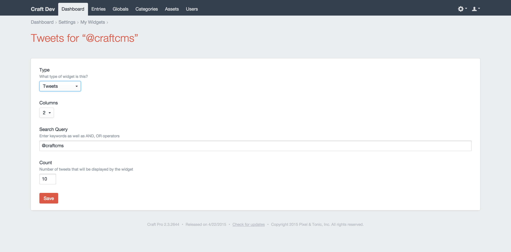

# Widget

## The Widget

The Twitter Search widget allows you to keep an eye on important Twitter activity 
and show you a list of recent tweets on your dashboard, based on a search string.

## Settings

- **Columns:** Number of columns the widget has.
- **Search:** Search query. See options in Twitter API Docs: [GET search/tweets](https://dev.twitter.com/rest/reference/get/search/tweets).
- **Count:** Number of tweets that will be displayed by the widget.

